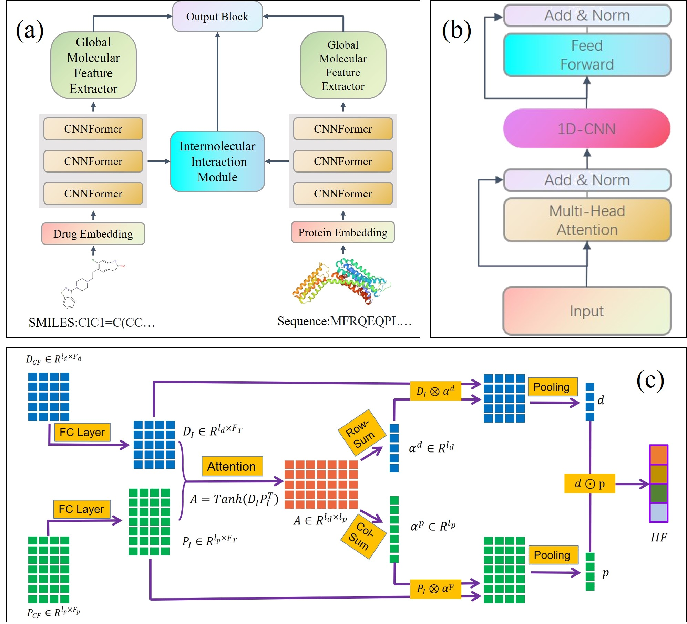

# GIFDTI
GIFDTI: Prediction of drug-target interactions based on global molecular and intermolecular interaction representation learning
This repository contains the source code and the data.

## GIFDTI

<div align="center">
<p></p>
</div>

## Setup and dependencies 

Dependencies:
- python 3.6
- pytorch >=1.2
- numpy
- sklearn
- tqdm
- tensorboardX
- prefetch_generator

## Resources:
+ README.md: this file.
+ data: The datasets used in paper.
	+ DrugBank2021.txt:  
	+ KIBA.txt: 
	+ Davis.txt
	+ BindingDB
	In the directory of data, we now have the original data "DrugBank/KIBA/Davis.txt" as follows:

	```
	Drug_ID Protein_ID Drug_SMILES Amino_acid_sequence interaction
	DB00303 P45059 [H][C@]12[C@@H]... MVKFNSSRKSGKSKKTIRKLT... 1
	DB00114 P19113 CC1=NC=C(COP(O)... MMEPEEYRERGREMVDYICQY... 1
	DB00117 P19113 N[C@@H](CC1=CNC... MMEPEEYRERGREMVDYICQY... 1
	...
	...
	...
	DB00441 P48050 NC1=NC(=O)N(C=C... MHGHSRNGQAHVPRRKRRNRF... 0
	DB08532 O00341 FC1=CC=CC=C1C1=... MVPHAILARGRDVCRRNGLLI... 0

	```
+ dataset.py: data process.
+ main.py: train and test the model under S1 setting.
+ denovel.py: train and test the model under S2-s4 setting.
+ hyperparameter.py: set the hyperparameter 
+ model.py: model architecture


# Run:

python main.py
